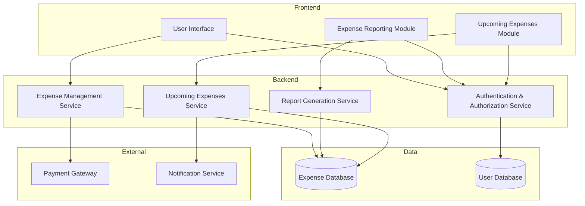

Below is a markdown file containing a Mermaid.js flowchart that represents the component diagram for an Expense Management System. The system components are grouped by layer: Frontend, Backend, Data, and External. I've used subgraphs for layers and arrows to show dependencies between components.

```markdown
# Expense Management System Component Diagram


```

This diagram captures the core components and their interactions within the Expense Management System, aligning with the specified requirements. The Frontend layer contains the user interface and modules for expenses and reporting. The Backend layer handles the core services for managing expenses, generating reports, and managing upcoming expenses, as well as authentication. The Data layer includes databases for expenses and user information. Lastly, the External layer consists of integrations with a payment gateway and a notification service.