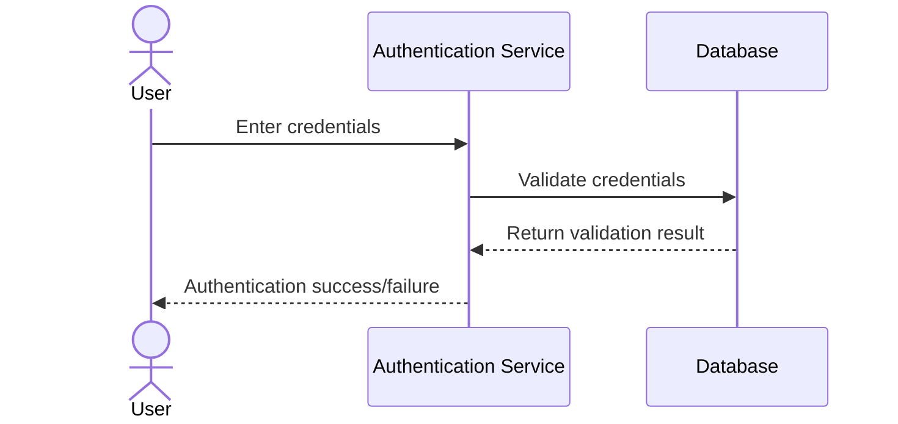
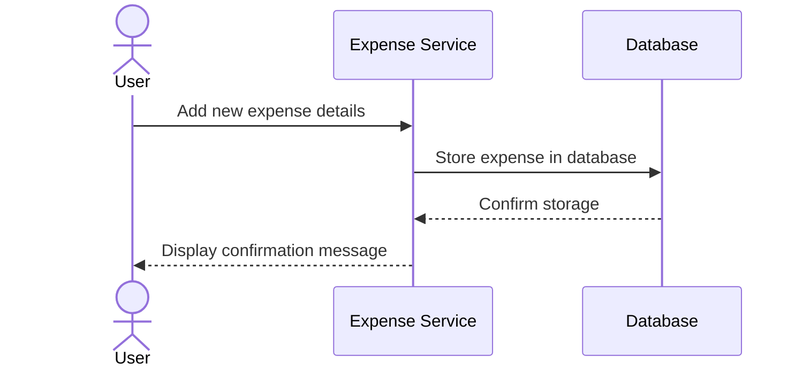
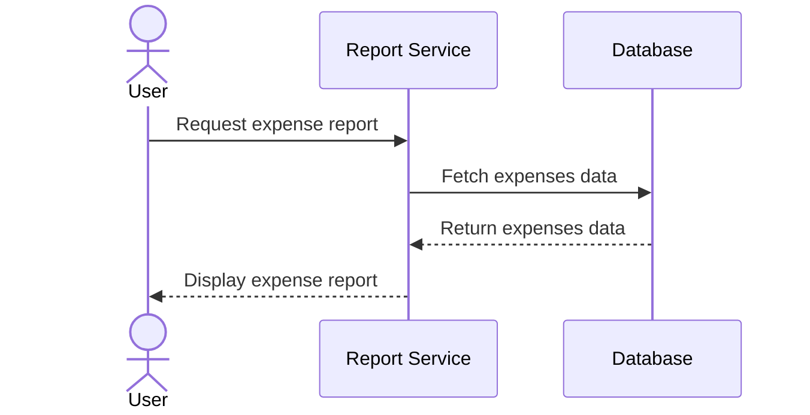
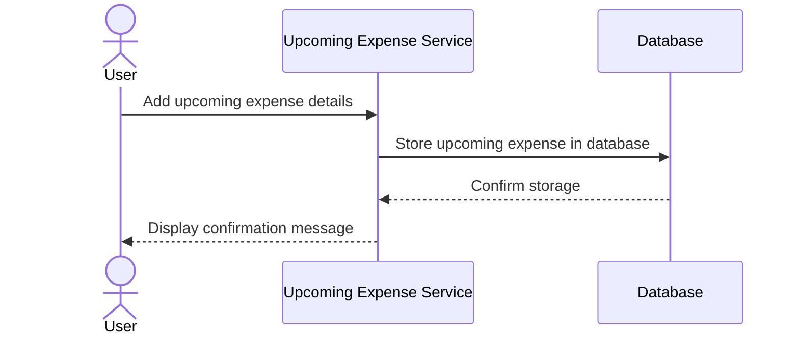
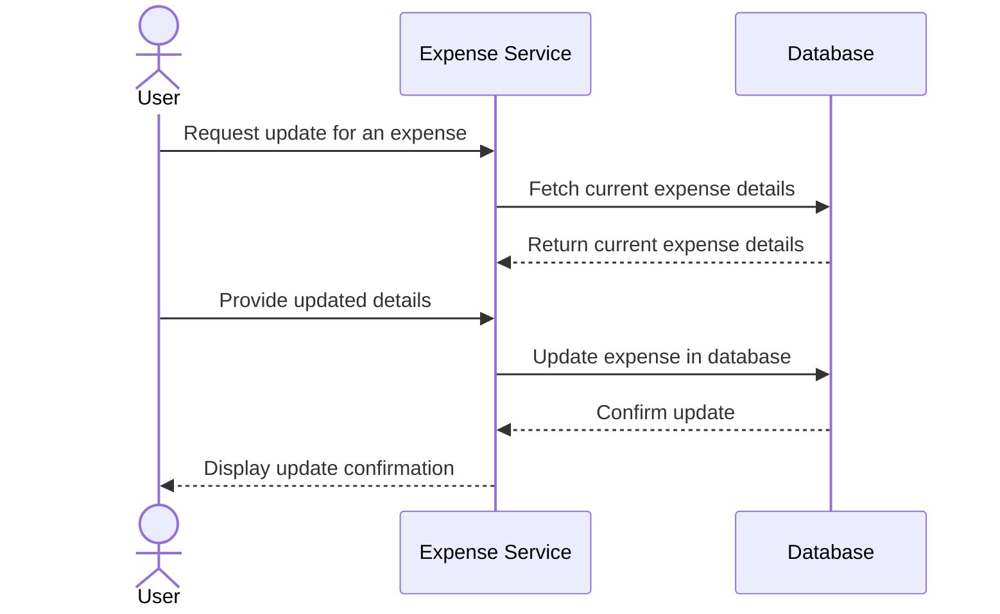

Below is a markdown file with Mermaid.js sequence diagrams that illustrate key user flows for an Expense Management System, including authentication, managing expenses, generating reports, and handling upcoming expenses.

```markdown
# Expense Management System Sequence Diagrams

## 1. User Authentication Flow



## 2. Add New Expense Flow



## 3. Generate Expense Report Flow



## 4. Manage Upcoming Expenses Flow



## 5. Update Existing Expense Flow


```

These sequence diagrams cover the key functionalities of the Expense Management System, focusing on user authentication, expense management, reporting, and handling upcoming expenses.