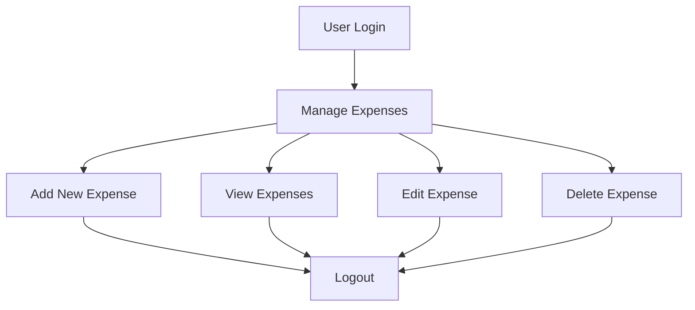
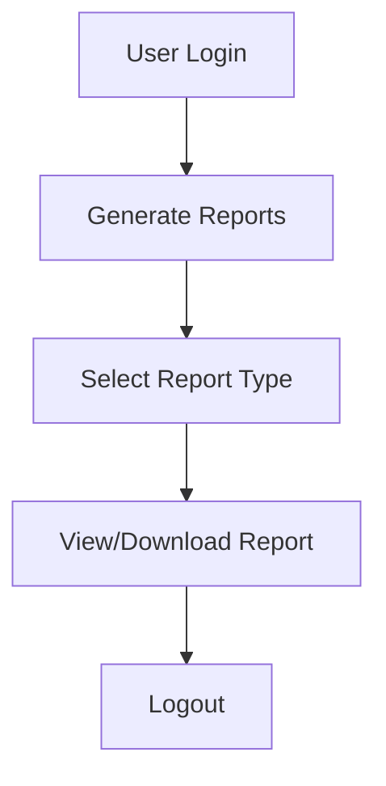
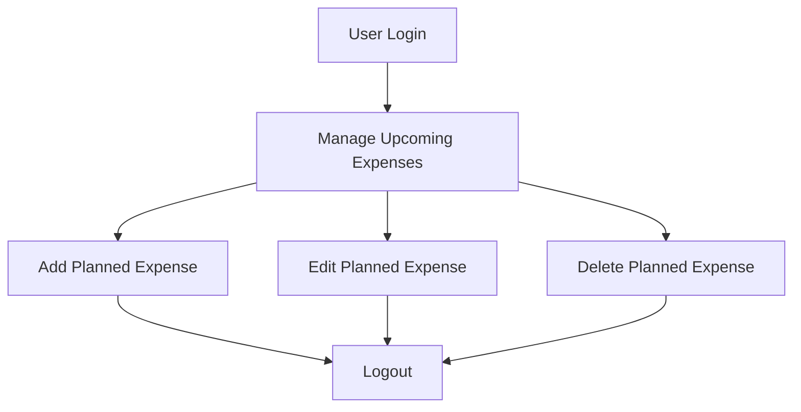
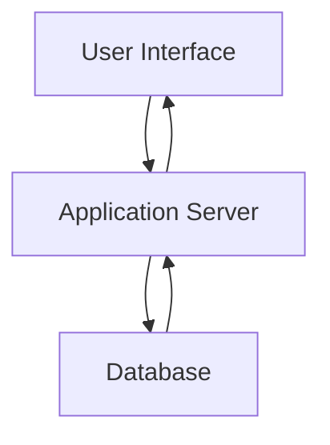

# Expense Management System Flow Documentation

## 1. User Workflows

### Overview
Users will interact with the Expense Management System through a web or mobile application to manage their expenses, generate reports, and plan for upcoming expenses.

### User Workflows

#### 1.1. Manage Expenses
- **Step 1:** User logs into the system.
- **Step 2:** User navigates to the "Manage Expenses" section.
- **Step 3:** User can add a new expense, view, edit, or delete existing expenses.
- **Step 4:** User logs out of the system.

#### 1.2. Generate Reports
- **Step 1:** User logs into the system.
- **Step 2:** User navigates to the "Reports" section.
- **Step 3:** User selects the type of report (e.g., monthly, quarterly) and time period.
- **Step 4:** User views or downloads the report.
- **Step 5:** User logs out of the system.

#### 1.3. Manage Upcoming Expenses
- **Step 1:** User logs into the system.
- **Step 2:** User navigates to the "Upcoming Expenses" section.
- **Step 3:** User adds, edits, or deletes planned expenses.
- **Step 4:** User logs out of the system.

## 2. Data Flows

### Overview
Data flows through multiple components of the system, including the database, application server, and user interface.

### Data Flow Steps

#### 2.1. Expense Data Flow
1. **User Input:** User inputs expense data through the UI.
2. **Application Server:** Data is sent to the application server.
3. **Database:** Application server processes and stores data in the database.
4. **UI Update:** UI is updated with the new/modified data.

#### 2.2. Report Data Flow
1. **User Request:** User requests a report through the UI.
2. **Application Server:** Request is processed by the application server.
3. **Database Query:** Application server queries the database.
4. **Generate Report:** Report is generated and sent back to the UI.

## 3. Integration Points

### Overview
The system integrates various components like user interfaces, application servers, databases, and external services for additional functionalities.

### Key Integration Points
- **User Interface & Application Server:** The UI interacts with the application server via RESTful APIs.
- **Application Server & Database:** The server communicates with the database using SQL queries.
- **External Services:** Integration with payment gateways or notification services through APIs for additional features such as reminders for upcoming expenses.

## 4. Error Handling

### Overview
The system implements robust error handling to ensure reliability and user satisfaction.

### Error Handling Strategies

#### 4.1. User Interface
- **Input Validation:** Ensure all user inputs are validated at the client-side.
- **Error Messages:** Display user-friendly error messages for incorrect inputs.

#### 4.2. Application Server
- **Exception Handling:** Implement try-catch blocks to handle exceptions and ensure the system remains stable.
- **Logging:** Log errors for future analysis and debugging.

#### 4.3. Database
- **Transaction Management:** Use transactions to ensure data integrity.
- **Error Logging:** Log database errors for monitoring and debugging.

#### 4.4. External Services
- **Fallback Mechanisms:** Implement fallback mechanisms if an external service is unavailable.
- **Retry Logic:** Implement retry logic for transient errors in external service calls.

This documentation provides a structured approach to understanding and developing the Expense Management System, ensuring clarity and efficiency in the development process.